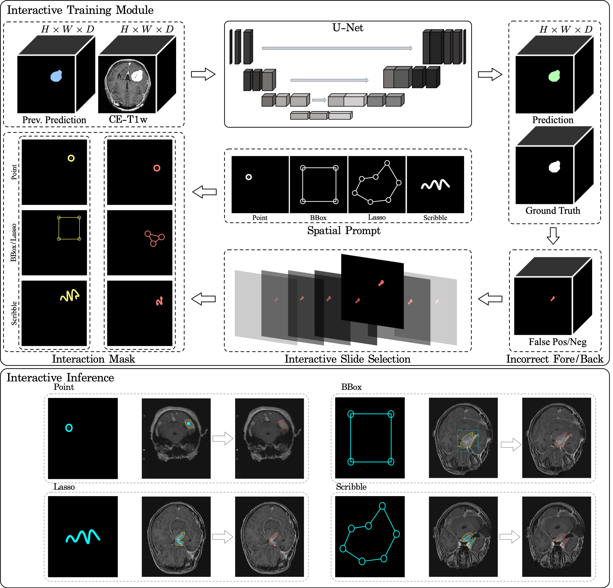

# Interactive-MEN-RT: Domain-Specialized Interactive Segmentation Framework for Meningioma Radiotherapy Planning


[](https://opensource.org/licenses/Apache-2.0)
[](https://www.python.org/downloads/)
[](https://pytorch.org/)
[](link-to-paper)
[](https://janghana.github.io/Interactive_MEN_RT/)
[](https://github.com/snuh-rad-aicon/Interactive-MEN-RT)

<p align="center">
  
</p>

## TL;DR:
Interactive medical image segmentation for meningioma radiotherapy planning.

## 🎯 Overview

**Interactive-MEN-RT** is a specialized Interactive Medical Image Segmentation (IMIS) tool designed specifically for clinician-assisted 3D meningioma segmentation in radiotherapy workflows. Built upon the robust [nnInteractive](https://github.com/MIC-DKFZ/nnInteractive) framework, our method integrates advanced AI with clinical expertise for precise tumor delineation.

## 🎮 Live Demo

Try our interactive segmentation demo without any installation:

**🔗 Demo Link: [Gradio Live](https://ac723ee27a470d36ef.gradio.live)**

- No installation required
- Runs on pre-loaded BraTS 2025 meningioma cases
- Interactive point-based segmentation
- Real-time 3D visualization

*Note: This demo runs on our secure servers with pre-trained model weights.

### ✨ Key Features
- 🧠 **Domain-Specialized**: Specifically optimized for meningioma radiotherapy planning
- 🎮 **Multiple Interaction Modes**: Point, scribble, bounding box, and lasso interactions
- 🚀 **High Performance**: Achieves 77.6% Dice and 64.8% IoU on BraTS 2025 dataset
- 🔧 **Built on nnU-Net**: Leverages nnU-Net V2 architecture with nnInteractive inference
- 🏥 **Clinical Ready**: Designed for seamless integration into RT workflows
- 📦 **Pre-trained Weights**: Ready-to-use model weights available

## 🛠️ Installation

### Prerequisites
- Linux or Windows with NVIDIA GPU
- Python 3.10+
- CUDA 11.3+ (recommended: CUDA 11.7 or 12.1)
- 10GB+ GPU memory for inference

### Quick Setup
```bash
# Clone repository
git clone https://github.com/snuh-rad-aicon/Interactive-MEN-RT.git
cd Interactive-MEN-RT

# Create environment
conda create -n interactive_men_rt python=3.10
conda activate interactive_men_rt

# Install PyTorch (CUDA 11.7 example)
pip install torch==1.13.1+cu117 torchvision==0.14.1+cu117 --extra-index-url https://download.pytorch.org/whl/cu117

# Install dependencies
pip install -r requirements.txt

# Download pre-trained weights
python scripts/download_weights.py --model interactive_men_rt
```

## 🚀 Quick Start

### Demo with Sample Data
```bash
# Run interactive demo
python demo.py --image_path samples/case_001_t1c.nii.gz
```

### Test on Your Data
```bash
python test_Interactive_MEN_RT.py \
    --model_path pretrained_weights/Interactive_MEN_RT/ \
    --image_path /path/to/your/t1c.nii.gz \
    --interaction_type lasso \
    --output_dir results/
```

## 🎯 Interactive Segmentation

<p align="center">
  
  <br>
  <em>Real-time interactive 3D meningioma segmentation with clinical-grade precision</em>
</p>

## 📝 Citation

If you use Interactive-MEN-RT in your research, please cite:

```bibtex
@inproceedings{interactive-men-rt-2025,
  title={Domain-Specialized Interactive Segmentation Framework 
         for Meningioma Radiotherapy Planning},
  author={Lee, Junhyeok and Jang, Han and Choi, Kyu Sung},
  booktitle={MICCAI CLIP Workshop},
  year={2025},
  url={https://github.com/snuh-rad-aicon/Interactive-MEN-RT}
}
```

## 📧 Contact

- **Principal Investigator**: Kyu Sung Choi (ent1127@snu.ac.kr)
- **Lead Developers**: Junhyeok Lee, Han Jang
- **GitHub Issues**: [Create an issue](https://github.com/snuh-rad-aicon/Interactive-MEN-RT/issues)

## 🙏 Acknowledgments

This work builds upon:
- [nnInteractive](https://github.com/MIC-DKFZ/nnInteractive) by Fabian Isensee et al. (used for baseline training)
- [nnU-Net](https://github.com/MIC-DKFZ/nnUNet) framework
- BraTS 2025 Meningioma RT Segmentation Challenge organizers

## 📄 License

This project is licensed under the Apache License 2.0 - see the [LICENSE](./LICENSE.txt) file for details.

---

<p align="center">
  Developed with ❤️ at Seoul National University AICON Lab
</p>